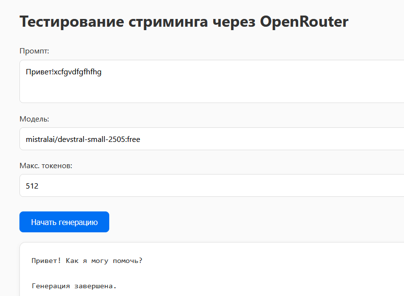
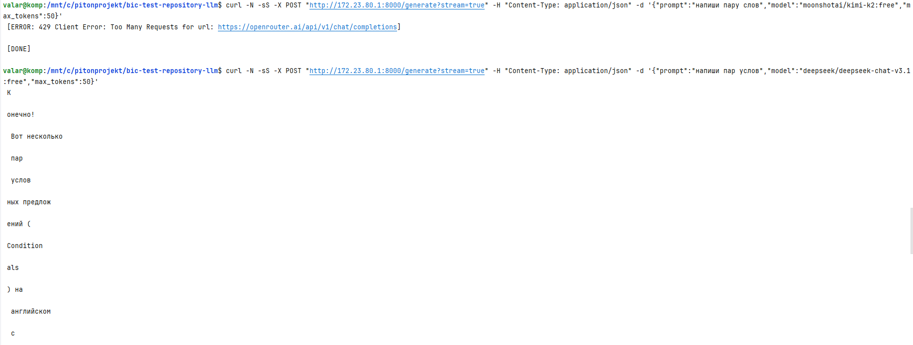
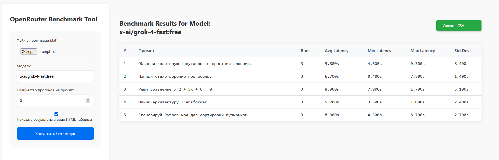
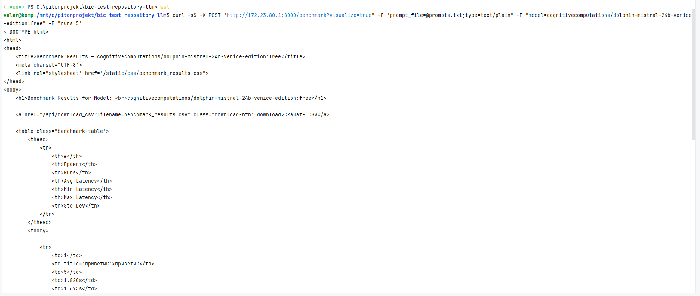
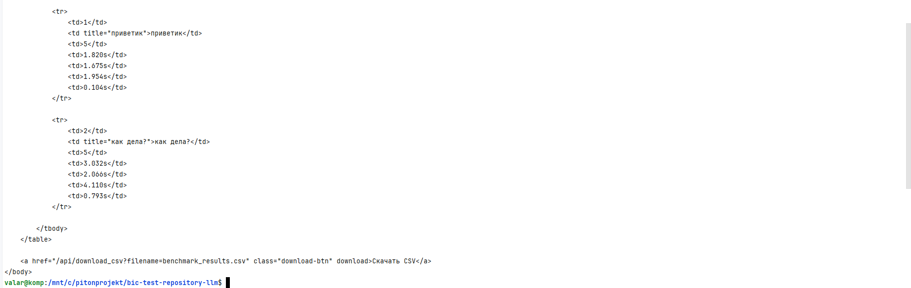
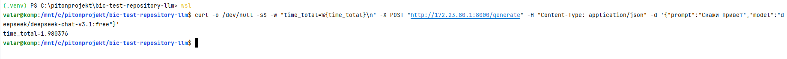
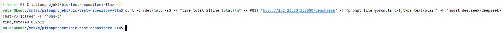
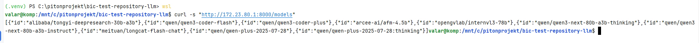
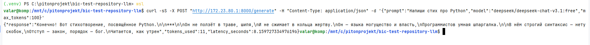
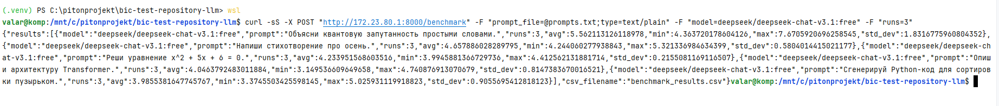

# Репозиторий с тестовым заданием

* Сваггер http://127.0.0.1:8000/api/docs

---

* [ ] `/generate`: при `stream=true` — **SSE-стриминг**.

* вёрстка SSE-стриминга с моделью http://127.0.0.1:8000/stream_test




* SSE-стриминг http://127.0.0.1:8000/generate?stream=true



---

* [ ] `/benchmark`: при `visualize=true` — вернуть **HTML-таблицу**.

* вёрстка бенчмарка http://127.0.0.1:8000/benchmark_ui



* бенчмарк c HTML-таблицей http://127.0.0.1:8000/benchmark?visualize=true





---

* [ ] Провести 10 тестов: 5 для `/generate` (разные модели, включая stream), 5 для `/benchmark` (≥3 промпта, разные `runs`).

* [benchmark_results.csv](app/exports/benchmark_results.csv)

---

* [ ] Замерить общую latency (например, `curl -w "%{time_total}"`).





---
* [ ] Сравнительная таблица моделей (средняя задержка + `std_dev`).

---
* [ ] Приложить: `benchmark_results.csv`, `server_logs.txt`, скриншоты ответов.
* [benchmark_results.csv](app/exports/benchmark_results.csv)
* [server_logs.txt](logs/server_logs.txt)

---


## Сваггер
http://127.0.0.1:8000/api/docs

## Примеры cURL (для проверки)

**0) Так как у меня Windows, то curl-у использую в wsl. Узнаем ip хоста Windows**
    cat /etc/resolv.conf | grep nameserver | awk '{print $2}'
    172.23.80.1

**1) Получить список моделей**

```bash
curl -s "http://172.23.80.1:8000/models"
```


**2) Генерация (базовый POST JSON)**

```bash
curl -sS -X POST "http://172.23.80.1:8000/generate" -H "Content-Type: application/json" -d '{"prompt":"Напиши стих про Python","model":"deepseek/deepseek-chat-v3.1:free","max_tokens":100}'
```


**3) Генерация в стриминге (SSE)**

вёрстка стриминга с моделью 
http://127.0.0.1:8000/stream_test

вёрстка бенчмарка
http://127.0.0.1:8000/benchmark_ui

```bash
curl -N -sS -X POST "http://172.23.80.1:8000/generate?stream=true" -H "Content-Type: application/json" -d '{"prompt":"Дай пошаговое решение 1+1, стримом","model":"moonshotai/kimi-k2:free","max_tokens":50}'
curl -N -sS -X POST "http://172.23.80.1:8000/generate?stream=true" -H "Content-Type: application/json" -d '{"prompt":"напиши пар услов","model":"deepseek/deepseek-chat-v3.1:free","max_tokens":50}'
```

> Флаг `-N` (no-buffer) позволяет видеть приходящие SSE-ивенты сразу.
> 


**4) Benchmark (multipart/form-data)**

```bash
curl -sS -X POST "http://172.23.80.1:8000/benchmark" -F "prompt_file=@prompts.txt;type=text/plain" -F "model=deepseek/deepseek-chat-v3.1:free" -F "runs=3"
```


**5) Benchmark с визуализацией (HTML-таблица)**

```bash
curl -sS -X POST "http://172.23.80.1:8000/benchmark?visualize=true" -F "prompt_file=@prompts.txt;type=text/plain" -F "model=moonshotai/kimi-k2:free" -F "runs=5"
curl -sS -X POST "http://172.23.80.1:8000/benchmark?visualize=true" -F "prompt_file=@prompts.txt;type=text/plain" -F "model=cognitivecomputations/dolphin-mistral-24b-venice-edition:free" -F "runs=5"
```


**6) Измерение полной latency (в секундах) для `/generate`**


```bash
curl -o /dev/null -sS -w "time_total=%{time_total}\n" -X POST "http://172.23.80.1:8000/generate" -H "Content-Type: application/json" -d '{"prompt":"Скажи привет","model":"deepseek/deepseek-chat-v3.1:free"}'
```

**7) Измерение полной latency для `/benchmark` (только время запроса)**

```bash
curl -o /dev/null -sS -w "time_total=%{time_total}\n" -X POST "http://172.23.80.1:8000/benchmark" -F "prompt_file=@prompts.txt;type=text/plain" -F "model=deepseek/deepseek-chat-v3.1:free" -F "runs=3"
```

